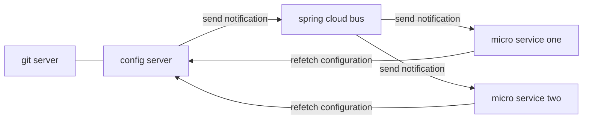

> spring cloud bus(kafka) + spring cloud config 实现热部署<br>
> spring cloud bus 用轻量级的消息代理来连接分布式系统中各节点,可以用来广播状态变化（如配置文件内容变化）或者其他消息指令
> 其核心思想是通过分布式的执行器(actuator)对springboot 进行应用扩展.ta也可以作为多应用之间的通信频道。
> spring cloud bus 提供了两种实现方式 基于消息中间件 Rabbit MQ 和 基于消息中间件Kafka

我们基于之前一篇文章 [spring cloud 配置中心 config + 服务发现注册中心 eureka](https://wujiezhang05.github.io/java/spring-cloud-config-eureka/)的内容，稍作改动来实现 基于spring cloud bus的动态热部署.

例子中的源码在github: [spring-cloud-bus-kafka](https://github.com/wujiezhang05/spring-cloud-study)




## config server
添加maven依赖
```xml
<dependencies>
        <dependency>
            <groupId>org.springframework.cloud</groupId>
            <artifactId>spring-cloud-config-server</artifactId>
        </dependency>

        <dependency>
            <!--support spring cloud bus-->
            <groupId>org.springframework.cloud</groupId>
            <artifactId>spring-cloud-starter-bus-kafka</artifactId>
        </dependency>
        <dependency>
            <groupId>org.springframework.boot</groupId>
            <artifactId>spring-boot-starter-actuator</artifactId>
        </dependency>
    </dependencies>
```
application.yml
```yaml
spring:
  application:
    name: config-server
  cloud:
    config:
      server:
        git:
          uri: https://github.com/wujiezhang05/spring-cloud-study # 你的仓库url
          search-paths: config-repo #仓库下的文件夹
          username: xxxxxx  # 你的账号
          password: xxxxxx  # 你的密码
    stream:
      kafka:
        binder:
          zk-nodes: localhost:2181 # zookeeper进程的IP:端口
          brokers: localhost:9092 # kafka进程的IP:端口

# 下面这段配置允许我们使用 actuator/bus-refresh 的post请求来触发config server refresh的请求。
management:
  endpoints:
    bus-refresh:
      enabled: true
    web:
      exposure:
        include: bus-refresh

server:
  port: 1111
```
kafka 的下载(包含zookeeper)请看官网[kafka](https://kafka.apache.org/downloads),
解压之后进入${kafka_home}/bin/windows（如果是liunux系统，进入${kafka_home}/bin/）
1. 启动zookeeper
  ```shell
  zookeeper-server-start ..\..\config\zookeeper.properties
  ```
2. 启动kafka
  ```shell
  kafka-server-start ..\..\config\server.properties
  ```

## micro service
添加 spring cloud bus kafka的依赖
```xml
<dependency>
    <groupId>org.springframework.cloud</groupId>
    <artifactId>spring-cloud-starter-bus-kafka</artifactId>
</dependency>
```
bootstrap.yml
```yaml
spring:
  application:
    name: micro-service-one
  cloud:
    config:
      uri: http://localhost:1111
```
micro service 会去config server中获取 名为:micro-sevice-one的配置文件。

Note: micro service two 一样的做法，只不过会去获取micro-service-two的配置文件
github.com/wujiezhang05/spring-cloud-study的config-repo文件夹下
micro-sevice-one 和 micro-sevice-two的内容分别为
micro-sevice-one.yaml
```yaml
server:
  port: 3333

eureka:
  client:
    serviceUrl:
      defaultZone: http://localhost:2222/eureka/

test: micro-service-one
```
micro-sevice-one.yaml
```yaml
server:
  port: 4444

eureka:
  client:
    serviceUrl:
      defaultZone: http://localhost:2222/eureka/

test: micro-service-two
```


在MicroServiceOne.java中加入
```java
@SpringBootApplication
@EnableDiscoveryClient
@RestController
@RefreshScope
public class MicroServiceOne {

    public static void main(String[] args) {
        SpringApplication.run(MicroServiceOne.class, args);
    }

    @Value("${test}")
    private String test;

    @RequestMapping("/test")
    public String test(){
        return this.test;
    }
}
```
这里的test，会返回micro-service-one/two 配置文件中的参数test的value。


## 测试
一次启动 config-server, discovery-server, micro-service-one, micro-service-two.

浏览器输入 http://localhost:3333/test 和 http://localhost:4444/test
显示结果


在github中修改文件micro-sevice-one.yaml，修改test 为micro-service-test,提交这个改动.


在CMD中输入命令
```shell
curl -X POST http://localhost:1111/actuator/bus-refresh
```
这时在micro-service-one 和 micro-service-two的log中可以看到 这两个service在试图重新获取配置文件。
刷下网页 http://localhost:3333/test


可以看到新的value已经更新了。

--------------------------------
spring cloud bus 还是很强大的，实际上的改动也只是一些配置和maven的依赖。
kafka是一个很强大的消息中间件,能以时间复杂度O(1)的方式提供消息持久化能力，对TB以上的数据也能保持常数时间复杂度访问性能。后面我要研究下ta.
